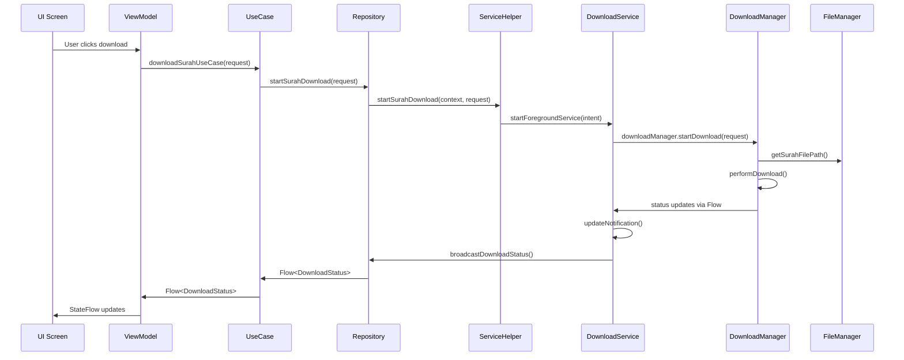
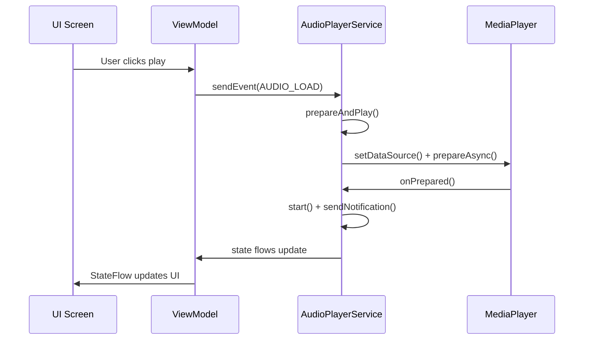

# Quran App Services - Complete Architecture Documentation

## 📋 Overview

This document provides comprehensive documentation for all services in the Quran Android app. It
follows clean architecture principles with proper separation of concerns, making it easy for AI
models and developers to understand the complete service flow.

## 🏗️ Service Architecture Overview

```
┌─────────────────────────────────────────────────────────────────┐
│                         Presentation Layer                      │
├─────────────────────────────────────────────────────────────────┤
│ Features (ViewModels) ←→ Domain Use Cases ←→ Repository Interface│
└─────────────────────────────────────────────────────────────────┘
                                    ↕
┌─────────────────────────────────────────────────────────────────┐
│                        Data Layer                               │
├─────────────────────────────────────────────────────────────────┤
│ Repository Implementation ←→ Service Helper ←→ Android Services  │
└─────────────────────────────────────────────────────────────────┘
                                    ↕
┌─────────────────────────────────────────────────────────────────┐
│                       Service Layer                             │
├─────────────────────────────────────────────────────────────────┤
│ QuranDownloadService + AudioPlayerService + Notification System │
└─────────────────────────────────────────────────────────────────┘
```

## 🎵 AudioPlayerService

### **Location**: `core/service/src/main/java/.../AudioPlayerService.kt`

### **Purpose**

Foreground service responsible for audio playback of Quran recitations with full media session
integration and background playback capabilities.

### **Key Features**

- ✅ Background audio playback
- ✅ Media session integration
- ✅ Notification media controls
- ✅ Reactive state management
- ✅ Auto-pause on completion
- ✅ Seek, fast-forward, rewind controls

### **Architecture Components**

#### **1. Service Lifecycle**

```kotlin
onCreate() → createDefaultNotification() → startForeground()
onStartCommand() → handleMediaActions() → updateNotification()
onDestroy() → cleanup() → stopForeground()
```

#### **2. State Management**

```kotlin
// Reactive state flows
val currentAudio: MutableStateFlow<Audio>
val maxDuration: MutableStateFlow<Int>
val currentDuration: MutableStateFlow<Int>
val isPlaying: MutableStateFlow<Boolean>
```

#### **3. Media Actions**

- **AUDIO_LOAD**: Load new audio file and start playback
- **PLAYPAUSE**: Toggle play/pause state
- **REWIND**: Seek backward 5 seconds
- **FORWARD**: Seek forward 5 seconds
- **SEEK_TO**: Seek to specific position

### **Usage Flow**

#### **From ViewModel:**

```kotlin
// 1. Bind to service
fun bindService(service: AudioPlayerService) {
    // Collect state flows and update UI
    combine(service.currentAudio, service.isPlaying, service.currentDuration)
}

// 2. Send commands
fun sendEvent(context: Context, audioEvent: AudioPlayerAction) {
    val intent = Intent(context, AudioPlayerService::class.java)
    intent.action = "audio-load" // or other actions
    intent.putExtra("AUDIO_PATH", audioUrl)
    context.startForegroundService(intent)
}
```

#### **Service Response:**

```kotlin
// Service updates state flows automatically
// ViewModel receives updates via combine()
// UI reactively updates via StateFlow collection
```

### **Notification Integration**

- **Channel ID**: `"quran_app_channel"`
- **Type**: Foreground service notification
- **Style**: MediaStyle with 3 action buttons
- **Controls**: Rewind, Play/Pause, Forward
- **Auto-update**: On state changes

---

## 📥 QuranDownloadService

### **Location**: `core/service/src/main/java/.../download/QuranDownloadService.kt`

### **Purpose**

Foreground service for downloading Quran audio files with enhanced progress tracking, error
handling, and clean architecture implementation.

### **Key Features**

- ✅ Background downloading
- ✅ Real-time progress tracking
- ✅ Download speed calculation
- ✅ Time remaining estimation
- ✅ Cancellation support
- ✅ Error recovery
- ✅ Android 13+ compatibility

### **Architecture Components**

#### **1. Clean Architecture Flow**

```
ViewModel → UseCase → Repository → ServiceHelper → DownloadService → DownloadManager
```

#### **2. Core Components**

- **QuranDownloadService**: Main service coordinator
- **DownloadManager**: Core download logic (business logic)
- **DownloadNotificationManager**: Notification handling
- **DownloadServiceHelper**: External API bridge

#### **3. Service Actions**

- **ACTION_START_DOWNLOAD**: Start new download
- **ACTION_CANCEL_DOWNLOAD**: Cancel current download
- **ACTION_CANCEL_DOWNLOAD_BY_ID**: Cancel specific download

### **Domain Entities**

#### **DownloadRequest**

```kotlin
data class DownloadRequest(
    val downloadUrl: String,
    val reciterName: String,
    val surahNumber: Int,
    val surahNameAr: String? = null,
    val surahNameEn: String? = null,
    val serverUrl: String,
    val downloadId: String = generateDownloadId(...)
)
```

#### **DownloadStatus** (Sealed Class)

```kotlin
sealed class DownloadStatus {
    object Idle
    object Starting
    data class InProgress(val downloadProgress: DownloadProgress)
    data class Completed(val filePath: String)
    data class Failed(val error: String, val errorCode: DownloadErrorCode)
    object Cancelled
    object Paused
}
```

#### **DownloadProgress**

```kotlin
data class DownloadProgress(
    val progress: Float,              // 0.0 to 1.0
    val downloadedBytes: Long,
    val totalBytes: Long,
    val downloadSpeed: Long,          // bytes per second
    val estimatedTimeRemaining: Long  // milliseconds
)
```

### **Usage Flow**

#### **1. From ViewModel:**

```kotlin
// Create download request
val downloadRequest = DownloadRequest(
    downloadUrl = url,
    reciterName = reciter,
    surahNumber = number,
    // ... other params
)

// Start download via use case
downloadSurahUseCase(downloadRequest).collect { status ->
    when (status) {
        is DownloadStatus.Starting -> updateUI("Starting...")
        is DownloadStatus.InProgress -> {
            val progress = status.downloadProgress
            updateUI("${progress.progressPercentage}% - ${progress.getFormattedSpeed()}")
        }
        is DownloadStatus.Completed -> updateUI("Completed: ${status.filePath}")
        is DownloadStatus.Failed -> updateUI("Error: ${status.error}")
        is DownloadStatus.Cancelled -> updateUI("Cancelled")
    }
}
```

#### **2. Service Processing:**

```kotlin
// Service receives intent
handleStartDownload(intent) →
// Extracts DownloadRequest  
extractDownloadRequest(intent) →
// Starts foreground service
startForeground(notificationId, notification) →
// Delegates to DownloadManager
downloadManager.startDownload(request) →
// Streams status updates
.onEach { status -> handleDownloadStatusUpdate(request, status) } →
// Updates notification and broadcasts status
updateNotification() + broadcastDownloadStatus()
```

#### **3. Communication Flow:**

```kotlin
// Service → Repository (via LocalBroadcastManager)
broadcastDownloadStatus(request, status) →

// Repository → ViewModel (via Flow)
callbackFlow<DownloadStatus> { 
    registerReceiver(broadcastReceiver) 
    // Converts broadcasts to Flow emissions
} →

// ViewModel → UI (via StateFlow)
_uiState.update { it.copy(downloadProgress = progress) }
```

---

## 🔔 Notification System

### **Architecture**

```
Application.onCreate() → createNotificationChannels()
Services → DownloadNotificationManager/AudioPlayerService → NotificationManager
```

### **Channel Configuration**

```kotlin
// In QuranApp (Application class)
const val CHANNEL_ID = "quran_app_channel"
const val BACKUP_CHANNEL_ID = "quran_downloads_v2"

// Channel properties
- Importance: IMPORTANCE_DEFAULT (required for foreground services)
- Sound: Disabled
- Vibration: Disabled  
- Lights: Disabled
- Badge: Disabled
- Visibility: VISIBILITY_PUBLIC
```

### **Notification Types**

#### **1. Download Notifications**

- **Starting**: Indeterminate progress bar
- **Progress**: Determinate progress with percentage, speed, ETA
- **Completed**: Success notification with auto-dismiss
- **Failed**: Error notification with error message
- **Cancelled**: Cancellation confirmation

#### **2. Audio Notifications**

- **Playing**: Media controls with current track info
- **Paused**: Media controls with paused state
- **Default**: Preparation state

### **Android 13+ Compatibility**

- ✅ Proper notification channel importance
- ✅ Foreground service types declared in manifest
- ✅ Runtime notification permissions handling
- ✅ Consistent channel IDs across all services

---

## 🗂️ File Management System

### **Location**: `core/ui/src/main/java/.../QuranFileManager.kt`

### **Purpose**

Centralized file management for Quran audio files with organized storage structure and security.

### **Storage Structure**

```
/Android/data/com.package.quran/files/Music/QuranAudio/
└── Surahs/
    ├── ahmad_huth_server8/
    │   ├── 001_Al-Fatihah_الفاتحة_ahmad_huth_server8.mp3
    │   ├── 002_Al-Baqarah_البقرة_ahmad_huth_server8.mp3
    │   └── ...
    ├── mishary_alafasy_server6/
    │   ├── 001_Al-Fatihah_الفاتحة_mishary_alafasy_server6.mp3
    │   └── ...
    └── ...
```

### **Key Features**

- ✅ App-specific directory (auto-cleanup on uninstall)
- ✅ No permissions required (Android 10+)
- ✅ Organized by reciter and server
- ✅ Unique file naming with Arabic/English names
- ✅ File existence checking
- ✅ Storage space management
- ✅ Automatic cleanup capabilities

### **File Naming Convention**

```kotlin
// Format: 001_Al-Fatihah_الفاتحة_[reciterIdentifier].mp3
fun generateSurahFileName(
    reciterName: String,
    serverUrl: String, 
    surahNumber: Int,
    surahNameAr: String?,
    surahNameEn: String?
): String
```

---

## 🔄 Complete Service Flow

### **Download Flow (End-to-End)**



### **Audio Playback Flow**



## 📊 Service State Management

### **Download States**

```kotlin
Idle → Starting → InProgress → (Completed|Failed|Cancelled)
                     ↑               ↓
                     └── Paused ──────┘
```

### **Audio States**

```kotlin
Idle → Preparing → Prepared → Playing ⟷ Paused
                                ↓
                           Completed → Idle
```

## 🎯 Integration Points

### **1. Dependency Injection (Koin)**

```kotlin
// In serviceModule
single<DownloadRepository> { DownloadRepositoryImpl(androidContext(), get()) }
single { QuranFileManager(androidContext()) }

// In usecaseModule  
single { DownloadSurahUseCase(get()) }
```

### **2. ViewModel Integration**

```kotlin
class ReciterSurahRecitationViewModel(
    private val downloadSurahUseCase: DownloadSurahUseCase // Injected
) {
    // Service integration methods
    fun fetchRecitation() // Download integration
    fun bindService()     // Audio service integration  
    fun sendEvent()       // Audio control integration
}
```

### **3. UI Integration**

```kotlin
@Composable 
fun ReciterSurahRecitationScreen() {
    val state by viewModel.uiState.collectAsStateWithLifecycle()
    val events by viewModel.event.collectAsState()
    
    // UI reacts to service states automatically
    when (events) {
        is FileDownloadEvent.InProgress -> ShowProgressUI()
        is FileDownloadEvent.Finished -> ShowAudioPlayer()
        // ... etc
    }
}
```

## 🔧 Configuration & Constants

### **Service Constants**

```kotlin
// Notification IDs
const val NOTIFICATION_ID_AUDIO = 1
const val NOTIFICATION_ID_DOWNLOAD = 3001

// Actions
const val ACTION_START_DOWNLOAD = "com.seifmortada.quran.action.START_DOWNLOAD"
const val AUDIO_LOAD = "audio-load"
const val PLAYPAUSE = "play-pause"

// Timeouts & Intervals
const val CONNECTION_TIMEOUT = 30_000
const val PROGRESS_UPDATE_INTERVAL = 1000L
const val DOWNLOAD_BUFFER_SIZE = 8 * 1024
```

### **Error Handling**

```kotlin
enum class DownloadErrorCode {
    NETWORK_ERROR,
    STORAGE_ERROR, 
    PERMISSION_ERROR,
    INVALID_URL,
    SERVER_ERROR,
    TIMEOUT,
    UNKNOWN
}
```

## 🚀 Best Practices & Guidelines

### **For AI Development:**

1. **Always use domain entities** (DownloadRequest, DownloadStatus)
2. **Follow clean architecture layers** - don't skip layers
3. **Use reactive programming** - collect Flows, emit StateFlows
4. **Handle all download states** - including error and cancellation
5. **Use consistent notification channels** - always "quran_app_channel"

### **For Service Extension:**

1. **Add new actions** to service constants first
2. **Extend domain entities** before implementation
3. **Update broadcast handling** for new status types
4. **Test Android 13+** foreground service requirements
5. **Maintain backward compatibility** with legacy methods

## ✅ Service Health Checklist

### **Download Service:**

- [ ] Notification channel exists with proper importance
- [ ] Foreground service starts without crashes
- [ ] Progress updates flow correctly to UI
- [ ] Cancellation works properly
- [ ] Error states handled gracefully
- [ ] File management works correctly

### **Audio Service:**

- [ ] Media session integration working
- [ ] Background playback continues
- [ ] Notification controls functional
- [ ] State synchronization accurate
- [ ] Service binding/unbinding clean

### **Overall Integration:**

- [ ] No memory leaks in service connections
- [ ] Proper service lifecycle management
- [ ] Clean architecture boundaries maintained
- [ ] Reactive programming principles followed
- [ ] Error handling comprehensive

---

This documentation provides the complete service architecture for the Quran app. All services follow
clean architecture principles with proper separation of concerns, making the system maintainable,
testable, and scalable.